# CS 424 Project 1: Chicago Traffic Crash Data - Crashes
## Md Nafiul Nipu, Farah Kamleh
## Introduction 

In this project, we explored Chicago traffic crash data that contained information about each traffic crash on city streets within the City of Chicago limits and under the jurisdiction of the Chicago Police Department (CPD). In particular, we analyzed crash data that had crash reports from the electronic crash reporting system at CPD.

## Description of the Dataset 

The dataset had 655k crash reports from 2005 to the present day consisting of 49 attributes related to the crash. Each crash report had information such as the date of the crash, posted speed limit, weather condition, lighting condition, crash type, injury involvement, location, and so on. Figure 1 shows the first five rows of the dataset. 

  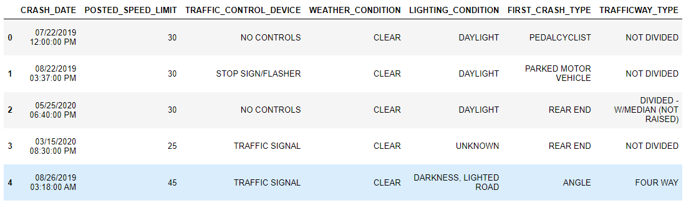

     

Fig 1. A snapshot of the dataset. Each row is a crash. Each column corresponds to different attributes related to a crash. 

However, we focused our exploration on 2019 to 2021 as our goal was to observe the effect of COVID-19 on traffic crash data. Additionally, we removed attributes that were not relevant to our exploration. 

## Data Exploration and Analysis
Our data analysis pipeline consisted of two stages. In the first stage, we generated several hypotheses and tested them using the dataset. In the next step, we focused on general trends and an overview of the data.  

### Hypotheses Analysis

#### Hypothesis 1: COVID - 19

Our first hypothesis was related to the COVID-19 pandemic. We hypothesized that there would be a decrease in the number of traffic crashes during lockdown caused by COVID-19. 

  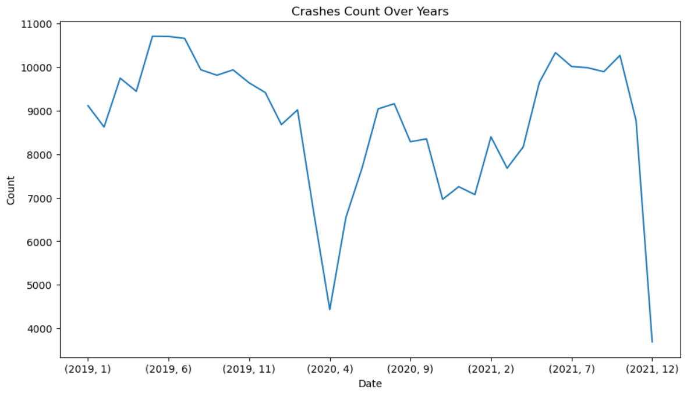

     

Fig 2. Line plot showing traffic crashes over the years from 2019-2021. A significant dip was observed during April 2020, mainly due to the corona lockdown. 

To prove our hypothesis, we plotted the traffic crashes for three years in a line plot (Fig 2). The plot reveals that traffic crashes started to decrease from March 2020, when Chicago went into lockdown. Then, there was a significant decrease in traffic crashes during April. Collision reports began to rise again in May. Our hypothesis was proven correct and supported by the data. 

#### Hypothesis 2: Lighting Conditions

We hypothesized that the highest number of crashes would occur in the daylight because people are more active during those hours. Figure 3 shows support to our hypothesis where it is clear that most of the crashes occurred when the lighting condition was clear (86.8%). 64.1% of crashes occurred during daylight, whereas 22.7% occurred on lighted roads.

  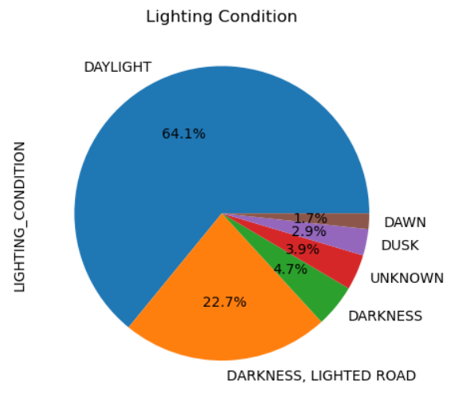

     

Fig 3. Line plot showing lighting conditions during the traffic crashes

#### Hypothesis 3: Weather Conditions
Our third hypothesis was based on the weather conditions. We hypothesized that most crashes would occur in weather conditions that make driving difficult such as rain and snow. The data did not support the hypothesis. It is clear from Figure 4 that most of the impacts occurred when the weather was clear. A possible reason is people are most likely to go out during clear weather conditions.

  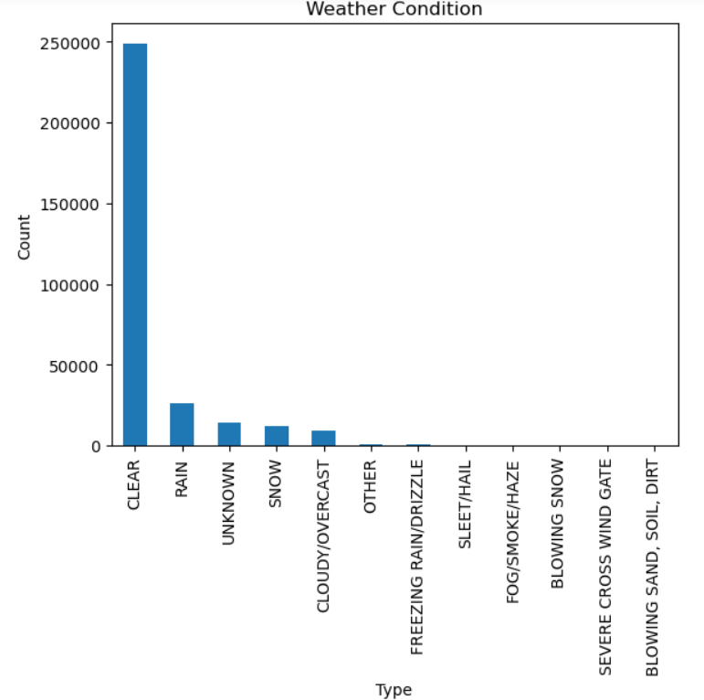

     

Fig 4. Bar chart showing weather conditions during the traffic crashes

#### Hypothesis 4: Hit and Run Cases
Our final hypothesis was that fewer crashes would fall under the category of a hit-and-run case. We found that 67.4% of crash reports did not have hit-and-run information. However, from the remaining 32.6%, 31.3% of cases were hit and run, creating concern about people's ethical choices. 

  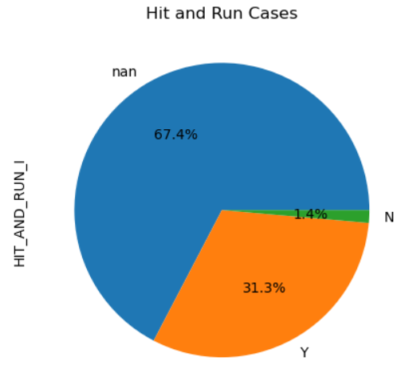

                                  

Fig 5. Pie chart showing hit and run cases

### Exploring General Trends and Overview of the Data

**Types of Injuries -** In most cases, there was “no indication of injury.” Few of the cases had non-incapacitating injuries. Among the injuries, fatal was the least common (Fig 6)

  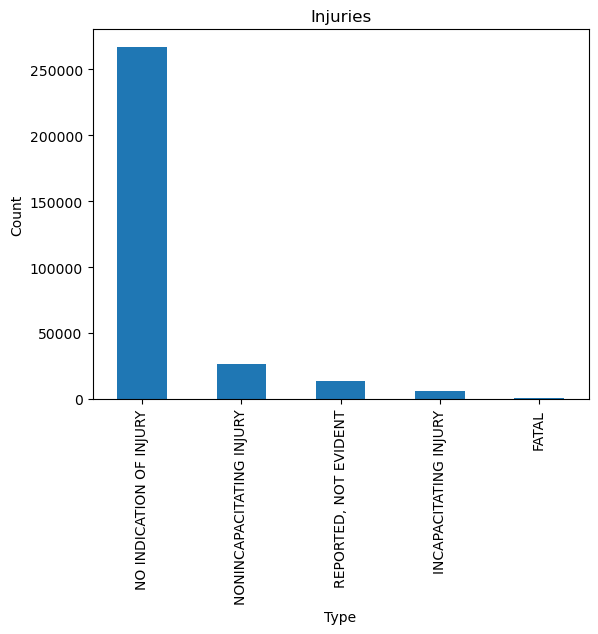

Fig 6. Bar chart showing the number of crashes based on the types of injuries

**Speed Limit of Traffic Crashes -** As presented in Figure 7, most crashes occurred when driving at the speed limit of 30.

  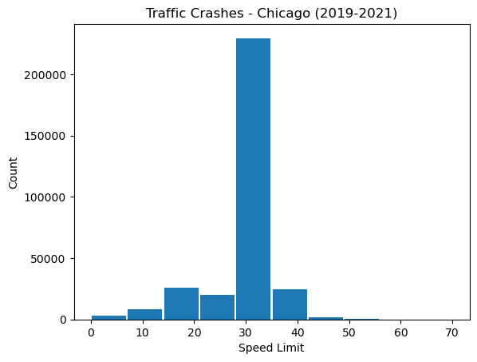

Fig 7. Bar chart showing the number of crashes based on the speed limit

**Average Time of Notifying Police After Crash Per Year -** The average time of notifying the police after a crash has occurred is about the same per year when compared. In 2019, the average time was about 776 minutes. In 2020, the average time was about 744 minutes. In 2021, the average time was about 791 minutes.

  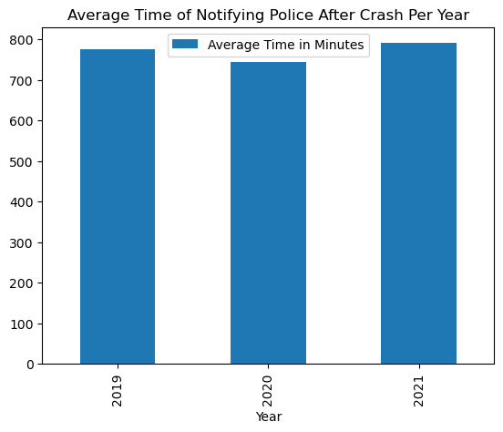

Fig 8. Bar chart showing the average time of notifying police after a crash has occurred per year

**Total Number of People Sustaining Injuries -** Figure 9 shows that, in the majority of the crashes reported, no people have sustained injuries. The highest number of people sustaining injuries after a crash is 5.

  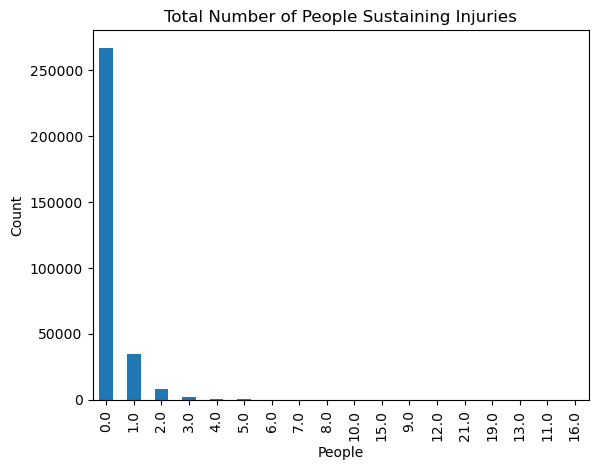

Fig 9. Bar chart showing the total number of people sustaining injuries

**Primary Contributory Causes -** According to Figure 10, the most common cause of a crash is failing to yield the right-of-way. The second most common reason is following another vehicle too closely. Finally, the third most common cause, barring “not applicable”, is failing to reduce speed to avoid a crash.

  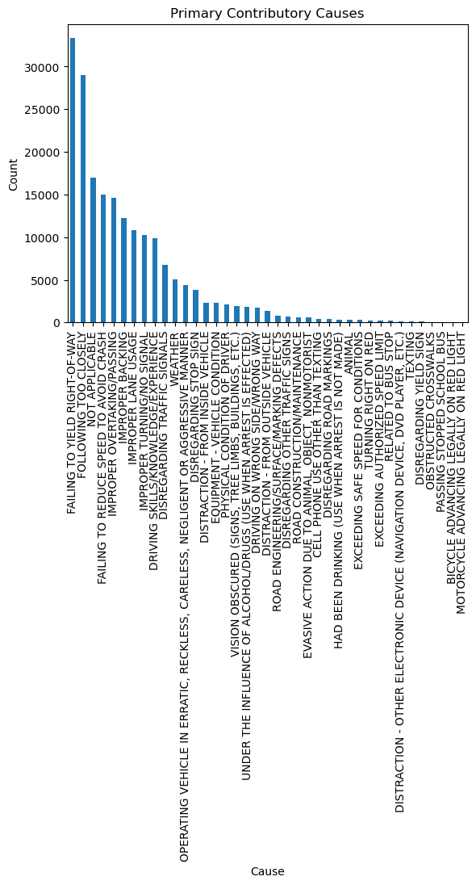

Fig 10. Bar chart showing the primary contributory causes of a crash

**Number of Crashes by Hours -** Majority of crashes occur between 3 PM and 5 PM, which is most likely due to rush hour. According to Figure 11 below, the greatest number of crashes occur at 4 PM. On the other hand, the least number of crashes occur at 4 AM. This is likely due to the fact that people are asleep at this time rather than out and about.

  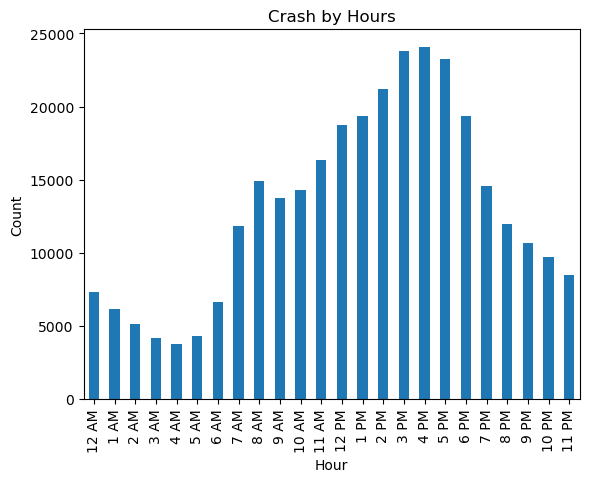

Fig 11. Bar chart displaying the number of crashes by hour

**Number of Crashes by Day of the Week -** The greatest number of crashes occur on a Friday while the least number of crashes occur on a Sunday.

  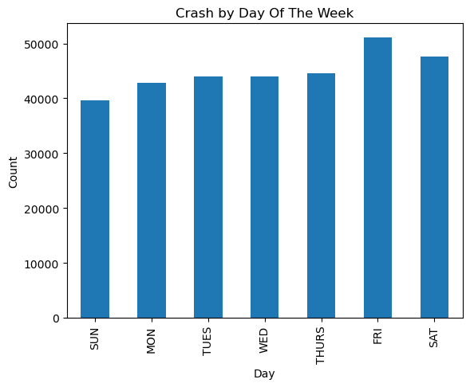

Fig 12. Bar chart displaying the number of crashes by day of the week

**Number of Crashes by Month -** The greatest number of crashes occur in July while the least number of crashes occur in December. It can be argued that the general trend appears to be that the majority of crashes happen during the summer while the minority of crashes happen during the winter.

  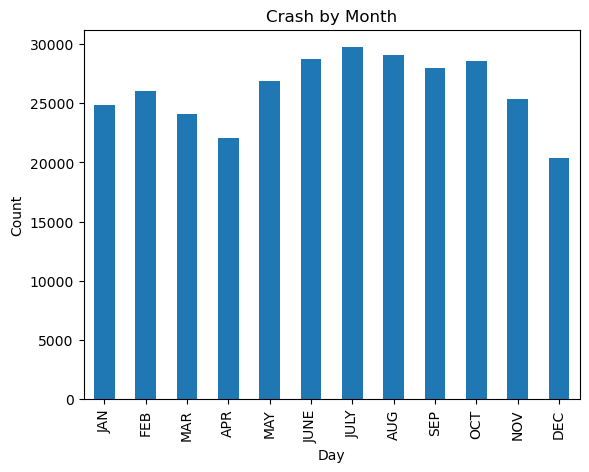

Fig 13. Bar chart displaying the number of crashes by month

### Comparison of Crashes Per Year

**Crash Count Over the Chicago Area -** From 2019 to 2021, it can be observed that there is an increase in the number of crashes in the west side of Chicago in Archer Heights, West Elsdon, and West Lawn.

  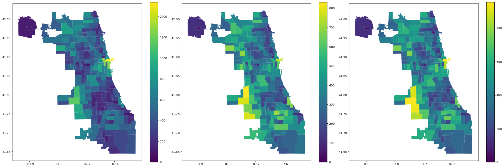

Fig 14. A geospatial comparison of crash count over the Chicago area between the years 2019, 2020, and 2021 from left to right

**Line Chart of Crashes by Month -** A general trend can be observed in which the number of crashes increase during the summer for 2019, 2020, and 2021. However, there is a notable difference in 2020 which is the major dip in crashes observed in the month of April. This is due to a lockdown which occurred from March 2020 to June 2020 in Chicago.

  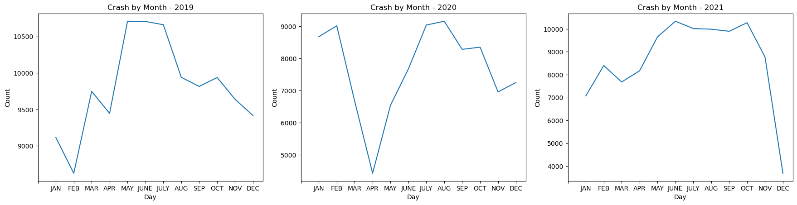

Fig 15. Line chart representations of the number of crashes per month for the years 2019, 2020, and 2021

**Bar Chart of Crashes by Month -** The same conclusions determined from Figure 15 can be made for Figure 16, as it is a bar chart representation of the same data. The significant decrease in crashes in April 2020 is arguably made more visible.

  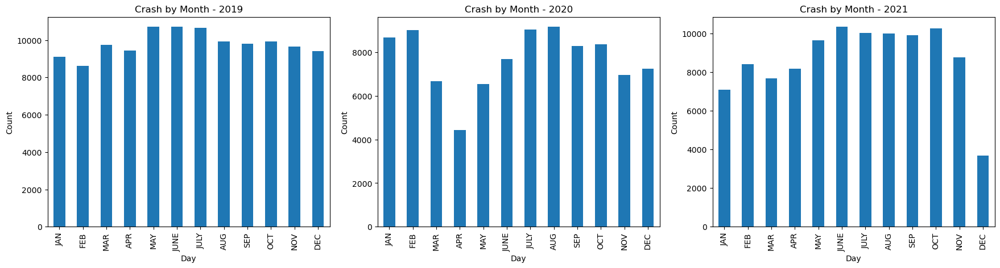

Fig 16. Bar chart representations of the number of crashes per month for the years 2019, 2020, and 2021

